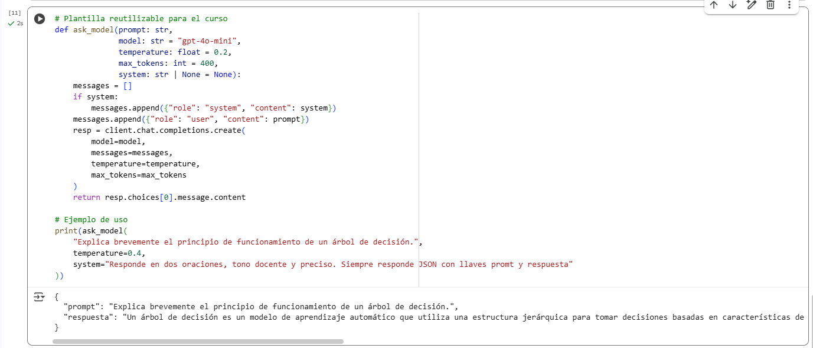

# AREP-Lab08-GuiasIA

Este repositorio contiene el desarrollo de las **Guías** del laboratorio de Arquitecturas Empresariales (AREP), enfocadas en el uso de **Modelos de Lenguaje (LLMs)** a través de la API oficial de OpenAI y el ecosistema de herramientas modernas como LangChain.

El contenido incluye ejecución local con entornos virtuales, configuración de claves mediante variables de entorno, construcción de clientes, experimentación con parámetros del modelo, creación de funciones reutilizables, utilización de notebooks y ejecución segura en Google Colab.

---

## Estructura del repositorio

La organización del proyecto es la siguiente:

```
AREP-LAB08-GUIASIA/
|
├── JupyterGuides/
│   ├── Guia1/
│   │   ├── guia1.ipynb
│   │   └── hello_ai.py
│   │
│   ├── Guia2/
│   │   └── setup_hello_ai.ipynb
│   │
│   ├── Guia3/
│   │   └── Guia3_IntroAPIsAI_Notebook.ipynb
│   │
│   └── Guia4/
│       └── Guia4_Introduccion_LangChain_OpenAI.ipynb
│
├── .env.example
├── .gitignore
└── README.md
```

---

# 1. Guía 1 – Introducción básica a OpenAI API

En esta guía se realizó:

- Creación de un entorno virtual Python.
- Instalación de dependencias mínimas (`openai`, `python-dotenv`).
- Configuración del archivo `.env` para almacenar de forma segura la clave de API.
- Creación del primer cliente de OpenAI.
- Ejecución de la primera consulta simple.
- Pruebas variando la temperatura para observar cambios en la creatividad del modelo.

### Evidencia


---

# 2. Guía 2 – Funciones reutilizables y prompts estructurados

En esta guía se construyó una plantilla reutilizable en Python para realizar consultas al modelo utilizando:

- Parámetros configurables (`system`, `temperature`, `max_tokens`).
- Mensajes estructurados en formato `system`, `user`.
- Respuestas en formato JSON cuando se requiere.

Se trabajó principalmente en Jupyter Notebook para facilitar la interacción con los prompts y las respuestas.

### Evidencia


---

# 3. Guía 3 – Ejecución en Google Colab usando Secrets

Aquí se replica el uso de la API, pero utilizando **Google Colab**.
Los objetivos fueron:

- Crear y almacenar la clave de API mediante **Colab Secrets**, evitando exponerla directamente.
- Instalar dependencias dentro del entorno de Colab.
- Probar el cliente de OpenAI tanto con `.env` como con `userdata.get()` desde el panel de secrets.

### Evidencias




---

# 4. Guía 4 – Introducción a LangChain con OpenAI

En esta guía se trabajó con:

- El uso del módulo `langchain_openai`.
- La construcción de prompts mediante `PromptTemplate`.
- El procesamiento de salidas con `StrOutputParser`.
- Primeras pruebas de pipelines con LCEL (`prompt | llm | parser`).

El notebook incluye ejemplos prácticos y la configuración necesaria para ejecutar LangChain de forma local.

---

# Ejecución local

## 1. Activar el entorno virtual

Windows:

```
.\.venv\Scripts\activate
```

Linux/Mac:

```
source .venv/bin/activate
```

---

## 2. Instalar dependencias

```
pip install openai python-dotenv langchain langchain-openai
```

---

## 3. Configurar variables de entorno

Crear un archivo `.env` basado en `.env.example`:

```
OPENAI_API_KEY=sk-xxxxxxxx...
```

---

## 4. Ejecutar scripts o notebooks

Ejemplo:

```
python JupyterGuides/Guia1/hello_ai.py
```

O abrir cualquier `.ipynb` desde VS Code o JupyterLab.

---

# Estado de avance

| Guía   | Estado     |
| ------ | ---------- |
| Guía 1 | Completada |
| Guía 2 | Completada |
| Guía 3 | Completada |
| Guía 4 | Completada |
| Guía 5 | Pendiente  |

---

# Autor

Juan Esteban Medina Rivas
Escuela Colombiana de Ingeniería Julio Garavito
Curso AREP – Laboratorio08-IA
